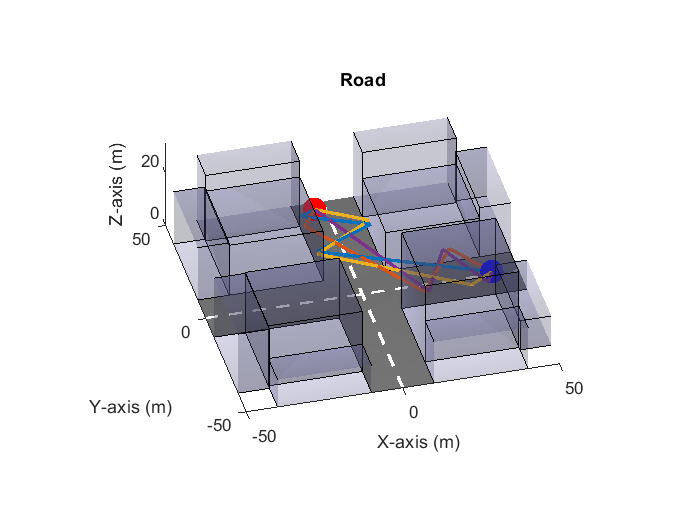

# V2V Communication Project

This project focuses on Vehicle-to-Vehicle (V2V) communication, exploring the theoretical and practical aspects of communication channels in vehicular networks. The aim is to analyze how the environment behaves and to build a channel model in the test conditions.

## Repository organization

- `./report/` contains the documentation with the `.tex` source code, the pictures and the last compiled pdf
- `./physicalFormulas/`, `./src/` and `./config.m` are the matlab functions used in the main scripts
- `./steps_specific/` and `./main.m` are the scripts to run for the simulation

## Questions

- Why are the $$\Gamma_{\perp}$$ values real and not complex - *question 3.2 in* `.\physicalFormulas\reflexion.m`
- $$P_{RX}$$ as function of $$P_{TX}$$ seems strange. More likely to be as function of distance - *question 3.3 in* `.\steps_specific\step3_3.m`

